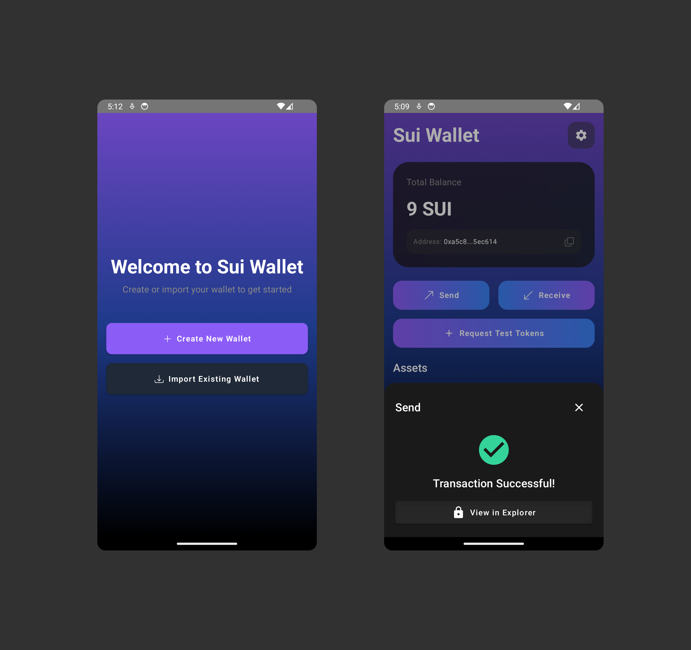

# Sui Wallet

Sui Wallet is a mobile wallet built with **Kotlin Multiplatform**, **Jetpack Compose**, and the 
**Sui Kotlin Multiplatform lib**, **Ksui**, showcasing seamless Sui blockchain integration.

## Features

- Account creation
- Account recovery
- Send Sui tokens
- Receive Sui tokens
- View transaction history

## Android

### Android APK

Download the Android APK [here](asset/sui-wallet.apk).

## iOS

## How to build

Head
over [here](https://www.jetbrains.com/help/kotlin-multiplatform-dev/compose-multiplatform-create-first-app.html?_gl=1*5zeajd*_gcl_au*MzY5NjYwMjYuMTczMTU0MTA0NA..*_ga*MzU4MjI3MjY3LjE3MDUxODA2Mjk.*_ga_9J976DJZ68*MTczNjE2MTE3MS4xMjAuMC4xNzM2MTYxMTcxLjYwLjAuMA..#run-your-application)
to learn how to build the application.

## License

    Copyright 2025 McXross

    Licensed under the Apache License, Version 2.0 (the "License");
    you may not use this file except in compliance with the License.
    You may obtain a copy of the License at

       http://www.apache.org/licenses/LICENSE-2.0

    Unless required by applicable law or agreed to in writing, software
    distributed under the License is distributed on an "AS IS" BASIS,
    WITHOUT WARRANTIES OR CONDITIONS OF ANY KIND, either express or implied.
    See the License for the specific language governing permissions and
    limitations under the License.